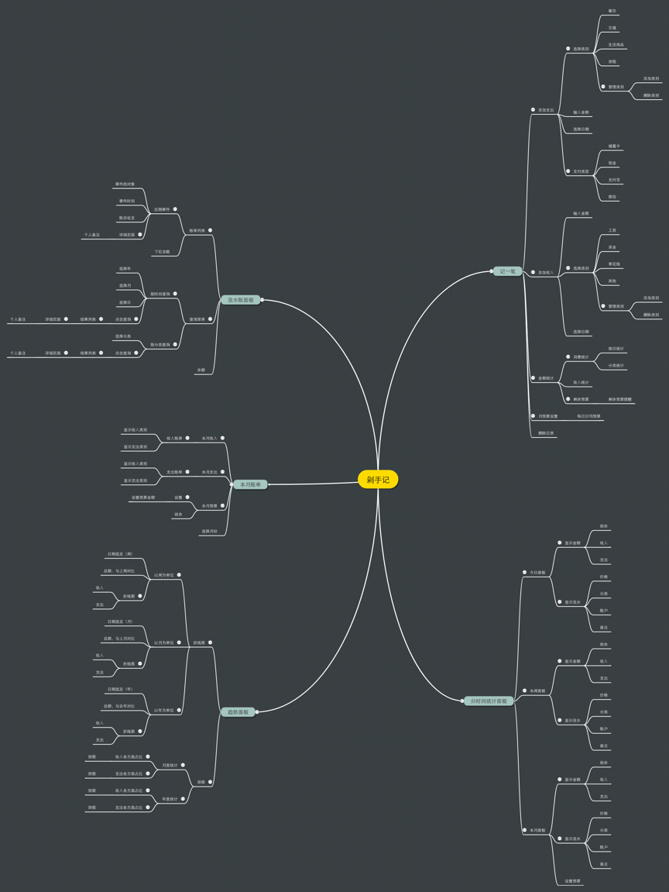

# 剁手记需求文档

**【产品名称】** 剁手记

**【小组成员】** 吉婉颖 蔡静 谭琳洁 张倍思 黄晓 李秋薇

**【主要用户】** 记录日常大小收入及消费的群体

**【产品目标】** 通过该产品，给用户提供更好的记账体验，方便用户随手记账

**【产品定位】** 记录日常收入和消费记录的轻量工具

**【功能列表】**

## 1.	记一笔

**记录支出和收入，有对应分类可选，如日常食品酒水消费，工资收入等**

记一笔功能类别下包含了五个部分，添加账户支出、添加账户收入、设定账户预算以及账户金额统计以及删除单个纪录。在主页面中点击添加记一笔按钮，选择五部分功能其一，可在进行记录输入时选择金额、类别以及日期并可以管理类别。在预算设置可以进行月预算的设置和管理。金额统计包括了支出统计、收入统计以及对于剩余余额进行显示。选择删除单个记录可以对已存在的记录进行删除管理。

### 添加账户支出
  - 选择类别
	 1. 餐饮类：包括三餐，小吃饮料，零食，土产粮油以及菜肉蛋果调味料。
	 2. 交通类：公交卡
	 3. 生活用品：日常服饰，生活用品 
	 4. 房租
	 5. 旅游类：出门旅游涉及的全部衣食住宿和交通娱乐
  - 输入金额
  - 选择日期
  - 管理支出类别（可增加支出类别和删除支出类别）
  
### 添加账户收入
  - 选择类别
	1. 工资
	2. 奖金
	3. 零花钱
	4. 其他
  - 输入金额
  - 选择日期
  - 管理收入类别（可增加收入类别和删除收入类别）

### 设定账户预算
  - 添加账户月预算
  - 修改账户月预算
 
### 账户金额统计
  - 支出统计: 分别按照日期以及分类对支出金额进行统计。
  - 收入统计
  - 剩余预算（可包含对于剩余预算的提醒）

## 2.	本月账单

**本月账单功能类别下包含本月收入、本月支出和本月预算三个功能单元，并且包括月份选择以便按月查看账单。**

主页面下这三个单元下分别显示本月总计收入、本月总计支出以及本月剩余预算。“本月收入”单元下是显示收入的流水账单，包含数额和消费类别，为从“记一笔”功能类别“收入”单元下读入的数据；“本月支出”单元下是显示收入的流水账单，包含数额和消费类别，为从“记一笔”功能类别“收入”单元下读入的数据；“本月预算”单元下包括两个部分“预算设置”和“结余”，“预算设置”为用户自己设置本月预算金额数量，“结余”将显示截至目前为止统计收入和支出后的总预算剩余量。

### 本月收入
   - 收入账单

### 本月支出
   - 支出账单

### 本月预算
   - 设置预算金额
   - 结余

## 3．分时间统计面板 

**分时间统计面板是对不同时间段收入和支出金额的显示。每个面板中又包括这段时间的金额和流水的显示。**

金额的显示是指，指定时间段内“收入”单元下显示收入的流水账单金额的总和，为从“记一笔”功能类别“收入”单元下读入的数据；指定时间段内“支出”单元下显示收入的流水账单金额的总和，为从“记一笔”功能类别“支出”单元下读入的数据； “结余”将显示指定时间段内收入和支出后的剩余量。
流水的显示是指收入和支出的流水账单，为从“记一笔”功能类别“收入”和“支出”单元下读入的数据。

### 统计面板
- 显示金额
	- 显示结余
	- 显示收入
	- 显示支出
- 显示流水
	- 显示价格
	- 显示分类
	- 显示账户
	- 显示备注

## 4. 流水账面板
**流水账面板主要由查询菜单和账单列表两部分组成。**

**查询菜单：** 可按时间和分类查询。按时间查询需要输入年、月、日后点击查询按钮，按分类查询则要选择分类，具体分类分为五类，参照“1.1.1选择类别”，二者一起选也可以；结果列表，点击事件，进入详细界面，该界面多出一项个人备注。

**账单列表：** 列出近期七项账目事件，账目事件包括事件主体、事件时间、事件收支，点击事件，进入详细界面；当手机下拉时，加载时间段靠近的事件。

### 查询菜单
   - 时间查询
     - 选择年
     - 选择月
     - 选择日
   - 事件查询
     - 餐饮类
     - 交通类
     - 生活用品
     - 房租
     - 旅游类
   - 点击查询
	 - 结果列表
	 - 点击事件
	 - 详细页面，个人备注
	 - 信息修改
	 
### 账单列表
   - 账单事件
     - 事件主体
     - 事件时间
     - 事件收支
   - 点击事件
	  - 详细页面，个人备注。
	  - 信息修改
   - 下拉加载
	  - 加载近期事件

## 5.趋势图，一段时间消费和收入趋势图，时间可选

### 折线图
   - 以周为单位
     - 收入总额，与近6周对比
     - 支出总额，与近6周对比   
   - 以月为单位，收入，支出
     - 收入总额，与近6月对比
     - 支出总额，与近6月对比
   - 以年为单位，收入，支出
     - 收入总额，与近6年对比
     - 支出总额，与近6年对比

### 饼图
   - 本月统计各方面支出收入占比
   - 年度统计各方面支出收入占比

### 功能脑图

